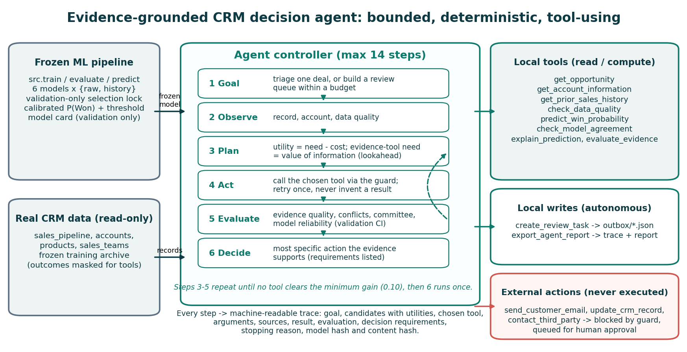

# Evidence-grounded CRM decision agent: architecture, policy and novelty hypothesis

This document specifies the agent added on top of the frozen CRM prediction pipeline. Code: `src/agent/`. Demo: `python -m src.agent_demo`. Evaluation: `python -m src.agent.experiment` (also run by `python -m src.run_project`). Measured results are in `reports/crm/final/agent/` and are summarized in `NOVELTY_AND_RESULTS.md`.

## 1. Problem and hypothesis

A traditional CRM model returns a score: deal → prediction → score → a human interprets it. On this dataset the score is weak (validation ROC-AUC ≈ 0.57, test ROC-AUC ≈ 0.52). Many open deals also lack the account data that the model was trained with. A score alone does not tell the reviewer whether to trust it, what evidence supports it, or what to do next.

**Novelty hypothesis.** A bounded agent changes the workflow in ways we can measure. It gathers its own evidence, checks reliability before it uses the score, and chooses the next tool by value of information. It then takes only safe local actions and records every step. With the same frozen model and the same cases, it should give fewer unsupported recommendations, catch more data issues, cite more verifiable evidence and leave fewer manual steps than a prediction-only pipeline or a fixed-rule assistant, at a measurable runtime cost. The hypothesis is about workflow quality. It is **not** about prediction accuracy or sales outcomes. The agent does not change the model, so it cannot improve ROC-AUC.

## 2. Components

| Component | File | Role |
|---|---|---|
| Policy | `src/agent/policy.py` | Every constant: tool costs, minimum gain, evidence weights, thresholds, step budget, permission classes, `SafetyGuard` |
| Tools | `src/agent/tools.py` | 8 read/compute tools, 2 local-write tools, 3 external tools that are never executed |
| Planner | `src/agent/planner.py` | Information-need tool selection with value-of-information lookahead; evidence-gated choice of the final action |
| Controller | `src/agent/controller.py` | Bounded loop, retries, guard, trace, content hash, batch prioritization |
| Baseline B | `src/agent/assistant.py` | The PR #4 rule-based assistant, unchanged in behaviour |
| Evaluation | `src/agent/scenarios.py`, `src/agent/experiment.py` | Scenarios, independent verifier, A/B/C comparison, ablations, outcome-masked replay |
| Demo | `src/agent_demo.py`, `src/assistant_demo.py` | One-command narrated demos (agent; rule assistant) |

## 3. Tools (all local; no network)

| Tool | Permission | What it returns | Source cited |
|---|---|---|---|
| `get_opportunity` | read | Pipeline fields, days open; refuses closed, Prospecting and unknown IDs | `sales_pipeline.csv` |
| `get_account_information` | read | Account profile | `accounts.csv` |
| `get_prior_sales_history` | read | Agent/account/product outcomes that closed strictly before engagement, from the frozen training archive | bundle archive |
| `check_data_quality` | compute | Blocking issues (missing / unmatched account); warnings (imputed inputs, unseen categories, out-of-range raw inputs, retrospective timing, stale record) | joined row + model card |
| `predict_win_probability` | compute | Calibrated P(Won), threshold, distance, model name, bundle SHA-256 | `model_bundle.joblib` |
| `check_model_agreement` | compute | Each learned model's score as a percentile of its own validation scores; committee split | `trained_models.joblib`, model card |
| `explain_prediction` | compute | Top reference sensitivities of the selected calibrated model (non-causal) | `explanation_reference.json` |
| `evaluate_evidence` | compute | Evidence quality, conflicts, risk signal, model reliability from the validation AUC CI | model card |
| `create_review_task` | local_write | JSON task in the run's `review_tasks/` outbox | local file |
| `export_agent_report` | local_write | Trace JSON + Markdown report | local file |
| `send_customer_email`, `update_crm_record`, `contact_third_party` | communication / external_write | Never executed: the guard raises `PolicyViolation`, the agent records an approval request | — |

Outcome fields (`close_date`, `close_value`, `is_won`, a closed deal's `deal_stage`) are never returned. In the replay pool, the labelled test deals have these columns removed before any tool can read them.

## 4. Decision process

1. **Goal.** `TRIAGE_OPPORTUNITY` (one deal) or `PRIORITIZE_REVIEW_QUEUE` (many deals, review budget K).
2. **Observe → plan → act → evaluate loop** (at most 14 steps). At each step the planner scores every applicable tool:
   `utility = need − cost`, and runs the best one only if `utility ≥ 0.10`. Fixed needs: opportunity 1.00, account 0.80, data quality 0.90, prediction 0.90 (0.30 when a blocking issue makes the score out of support). For history, model agreement and explanation, the need is a **one-step value of information**. The planner re-runs the decision rule with that slot set to its best and worst plausible result. If the final action could change, the slot is decision-relevant (0.80 / 0.70). If not, the need is 0.50 when a sales review task will be created (the reviewer needs context), else 0.05 (skip).
3. **Assess.** `evaluate_evidence` computes an evidence-quality score with fixed weights: account present 0.25, account history ≥ 5 closures 0.15, product history 0.10, agent history 0.10, no imputed inputs 0.15, inputs in training support 0.15, committee agrees 0.10. It also reports conflicts (score direction vs prior account win rate with a gap of at least 0.10; committee split ≥ 40%) and model reliability: *unusable* if the validation AUC 95% CI includes 0.5, otherwise *weak* below 0.65.
4. **Decide.** The agent takes the first action in this list whose requirements all hold. This picks the most specific action that the evidence supports:

| Action | Requirements |
|---|---|
| `ESCALATE_AT_RISK_REVIEW` | prediction; score at least 0.05 below the threshold; no blocking issue; evidence ≥ 0.70; no conflict; model not at chance; explanation available |
| `MONITOR_NO_TASK` | prediction; score at least 0.05 above the threshold; no blocking issue; evidence ≥ 0.70; no conflict; model not at chance |
| `REVIEW_UNCERTAIN` | prediction; no blocking issue |
| `DATA_COMPLETION` | a blocking data issue |
| `ABSTAIN` | always (invalid input, tool failure) |

5. **Act.** It writes a local review task (escalation, uncertain review, data completion). It blocks any requested external action and records it for human approval.
6. **Report.** It writes a trace with every step: candidates with need, cost, utility and reason; chosen tool; arguments; sources; result; evaluation; decision requirements; stopping reason; model name and bundle SHA-256; and a content hash that excludes timestamps.

**Batch goal.** Step 1 screens every deal (record, account, data quality, score). Step 2 ranks deals by investigation value: borderline 1.0, at risk 0.8, favourable 0.3, blocked or invalid 0, which go to the data queue. Step 3 investigates the top deals fully within an optional budget. Step 4 orders review tasks by the triage key (escalation before uncertain review; higher evidence quality; lower P(Won); longer open; ID) and creates at most K. Probabilities only break ties inside an evidence tier. They are not treated as business utility.

**Failure handling.** A failed tool is retried once, and the failure is recorded. No value is ever assumed. If the score cannot be obtained, the agent abstains.

## 5. What is and is not novel

| Contribution | Implementation | Evidence |
|---|---|---|
| Value-of-information tool planning: evidence is gathered only when it could change the action or is needed by the reviewer | `planner.value_of_information` | `ablation_summary.csv` (no_planning: more tool calls, same decisions) |
| Reliability-gated decisions: no confident label on out-of-support, borderline, conflicting or chance-level evidence | `planner.decision_candidates`, `assess` | `system_comparison.csv` unsupported-label rate; `no_reliability_checks` ablation |
| Strict-prior evidence retrieval with source citations, re-verified independently | `tools.get_prior_sales_history`, `experiment.Verifier` | claim verification rate; `no_evidence_retrieval` ablation |
| Bounded autonomy with a permission guard and approval queue | `policy.SafetyGuard`, `controller.act` | Scenario S7; network-blocked test |
| Machine-readable, replayable decision traces | `controller.run`, `experiment.replay_check` | determinism and tool-replay counts in `experiment.json` |
| Budgeted review-queue planning across deals | `controller.run_batch` | Scenario S5 |

**Known design limitation.** The value-of-information lookahead is one step deep. Each missing slot is judged with the others held at their current state. A slot that matters only together with another unknown slot can therefore look irrelevant. Example: on deal 01XZ9CRY, prior history ran with need 0.50 as reviewer context, not as decision-relevant, because escalation also needed the not-yet-computed explanation. A deeper lookahead is future work.

**Not claimed:** a new learning algorithm, online learning or reinforcement learning (there is no feedback signal), an LLM (none is used), better prediction accuracy, or sales or revenue uplift. The rule thresholds are design choices, not tuned on outcomes. The outcome-masked replay on the labelled test period is an offline check of whether the agent's tiers relate to outcomes. It feeds nothing back into the agent.
