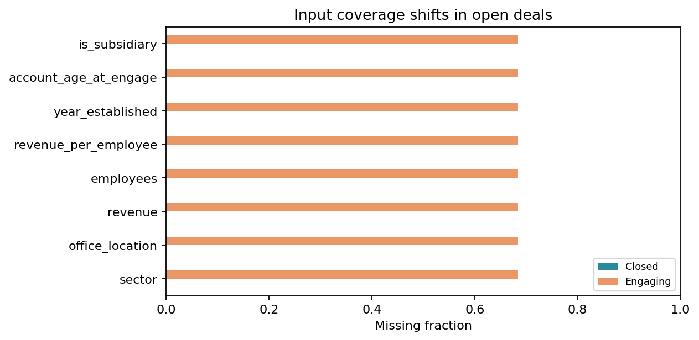
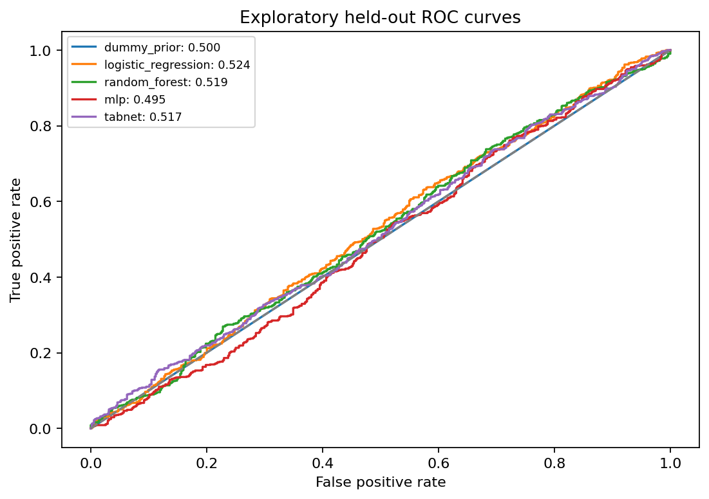
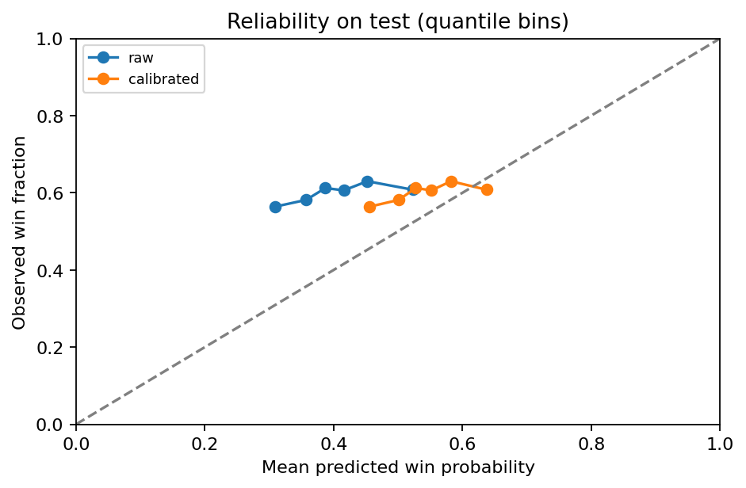
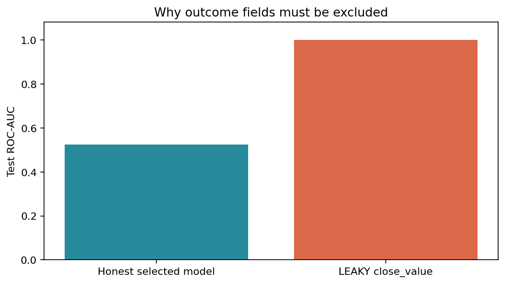
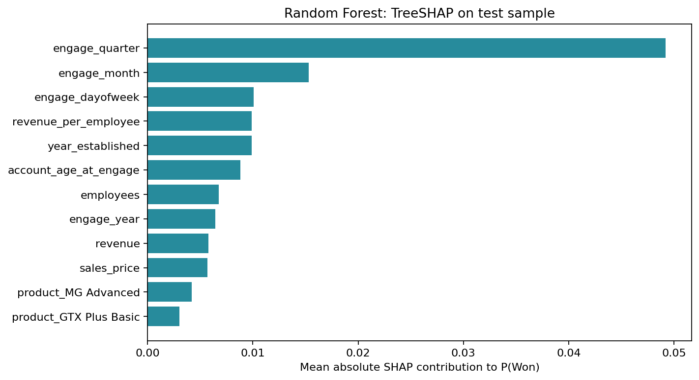

# Predicting CRM Sales Opportunities Using Machine Learning

CS 582 • Group 2 • Hong Thai Phan, Nguyen Khanh An Tran, Hoang Thien Bao Bui

Result-driven final paper draft for team review. Experiment mode: **full**. Generated from the run starting 2026-10-06T19:41:05.038515+00:00. This document has not been submitted. Team members must verify the narrative, authorship/contributions and instructor formatting requirements before submission.

## Abstract

We implement a reproducible CRM classification and explanation pipeline using the supplied Maven Sales Opportunities data. The system estimates P(Won) and P(Lost) and reports the input factors behind each score. We compare a prior-only control, Logistic Regression, Random Forest, MLP and TabNet using identical dated partitions and training-only preprocessing. To reduce future-label leakage, a training or validation deal is eligible only when its outcome was available before the next period. The resulting split contains 2,975 training, 583 validation and 1,361 test deals, with 1,792 late-label records purged. Logistic Regression is selected on validation ROC-AUC and reaches test ROC-AUC 0.5238. These results do not establish practically useful discrimination. A deliberately invalid close-value control demonstrates how outcome leakage can create a misleading near-perfect score. We provide calibrated snapshot scores, auditable local sensitivities, Random Forest SHAP diagnostics and explicit input-quality warnings. The contribution is an applied, explainable evaluation workflow and an honest negative finding, not a new learning algorithm or proven sales uplift.

## 1. Problem and intended use

Sales teams need to understand which opportunities may close successfully and why a model gives a particular score. Our target is binary: Won = 1 and Lost = 0 among observed closed opportunities. We seek a prediction at the engagement stage using attributes available before closing. Open records have unknown outcomes and are never assigned artificial Lost labels. This dataset does not support a fixed-horizon claim such as winning within 30 days; we model eventual recorded outcome conditional on closure being observed.

The expected outputs are (1) complementary win/loss probabilities and (2) the input factors associated with a higher or lower model score. A predicted class and simple priority band are added for demonstration. They are not a validated business intervention. In particular, changing an explanatory factor is not guaranteed to change the real sales outcome.

## 2. Related work and scope of contribution

Yan et al. [2] frame win propensity as a component of sales pipeline management and evaluate a data-driven approach on enterprise B2B data. Their work motivates our probability output; we do not reproduce their proprietary data or claim a comparable business benefit.

Rezazadeh [3] presents a B2B workflow connecting probabilistic training with prediction and decision boundaries. This motivates separating model fitting, evaluation and scoring. Our implementation uses a small, free CPU workflow rather than reproducing its Azure infrastructure or monetary evaluation.

Arik and Pfister [4] introduce sequential attention for tabular learning in TabNet. We compare an existing TabNet implementation [7] with simpler learners, without claiming that advanced architecture must improve this CRM dataset. We do not implement its self-supervised pretraining.

Our course-project contribution combines availability-aware splitting, an explicit leakage control, probability diagnostics, local explanations and missing-input warnings in one regenerable pipeline. Explainable CRM scoring already exists in the literature. We therefore describe our novelty as the design and audit of this particular applied workflow, rather than a previously unknown algorithm.

## 3. Data and preparation

Maven describes the source as a fictitious B2B computer-hardware company [1]. The supplied files contain 8,800 opportunities, 85 accounts, 7 products and 35 sales-team records, plus a data dictionary. The opportunity table is left-joined to product, account and team tables with many-to-one checks. Keys, stage values, numerical fields, dates and row counts are validated. Source CSV files are unchanged and SHA-256 hashes are saved in the run manifest.

The loader normalizes GTXPro to GTX Pro (1,480 pipeline rows) and fixes the documented sector spelling technolgy. There are 6,711 labeled records: 4,238 Won and 2,473 Lost. The 2,089 open records include 1,589 Engaging opportunities eligible for snapshot scoring and 500 Prospecting records, which are excluded. Among scored open records, 1,088 lack an account; 0 labeled records lack matched account attributes. Coverage differences limit the interpretation of open-deal scores.

Seven categorical predictors cover product, product series, account sector/location, regional office, manager and sales agent. Eleven numeric predictors cover product list price, account revenue and employees, revenue per employee, establishment year, account age, engagement calendar fields and subsidiary status. Revenue is expressed in millions in the source and is multiplied by one million when computing revenue per employee. We do not use account name as a predictor. close_value, close_date, deal_stage and opportunity_id are excluded from the feature matrix. close_date is read only for label availability; deal_stage defines the target; IDs preserve traceability.

Categoricals use constant missing-value imputation followed by one-hot encoding with unknown-category handling. Numeric values use training medians. Logistic Regression, MLP and TabNet also standardize numeric columns using training statistics. Missing open categories unseen during training are encoded as unknowns, so a missing-account warning remains necessary. EDA outcome comparisons use training rows; full-data missingness is an input-quality audit, not a model-selection signal.

## 4. Evaluation design

The 60th and 80th percentiles of ordered closed engagement dates define period boundaries. All rows sharing a boundary date stay in the same period. The validation period starts 2017-07-15; the test period starts 2017-09-18. A training row must engage and close before the validation boundary. A validation row must engage during its period and close before the test boundary. Test rows engage on or after the test boundary and have observed outcomes in the dataset. Counts are 2,975/583/1,361; 1,792 late outcomes are recorded in split_manifest.csv rather than silently reassigned.

The win fractions are 64.64% in training, 60.72% in validation and 60.03% in test. This is a single exploratory historical evaluation. Earlier project exploration already examined this dataset, and all boundaries are constructed retrospectively from the observed closed sample. The split is not an untouched prospective test and cannot remove closed-only selection bias or end-of-snapshot censoring.

All models receive exactly the same rows and feature roles. The model is chosen using validation ROC-AUC, with lower Brier score and then model name breaking ties. Class thresholds maximize validation macro-F1 over 0.10–0.90 in increments of 0.01; ties prefer the threshold closest to 0.50. No test statistic is used by the selection code. Neural early stopping also uses validation AUC, so the shared validation sample has several roles; a larger dataset should reserve a separate calibration/tuning sample or use nested temporal folds.

We report Accuracy, Precision, Recall, F1, ROC-AUC and confusion matrices as promised. Precision, recall and F1 treat Won as positive. Balanced accuracy, macro-F1, average precision, Brier and log loss provide additional context. Average precision is explicitly reported as AP, not mislabeled trapezoidal PR-AUC. F1 and accuracy can look favorable for a majority-Won model; the prior control is therefore essential.

## 5. Models and computation

Dummy prior outputs the training win fraction. Logistic Regression is an L2-regularized linear baseline. Random Forest uses bootstrap trees. MLP uses two ReLU hidden layers (64, 32), Adam, alpha 0.001 and learning rate 0.001. Its best validation checkpoint is retained. TabNet uses CPU attention steps with n_d = n_a = 8, n_steps = 3, learning rate 0.02, batch size 256 and virtual batch size 64. Its best validation checkpoint is also retained. We use seed 42 and limit numerical threads. These are fixed, modest comparison budgets, not an exhaustive hyperparameter search.

Actual settings for this run:

- Dummy prior: {"seed": 42, "class_weight": null, "device": "cpu", "quick": false}
- Logistic Regression: {"seed": 42, "class_weight": null, "device": "cpu", "quick": false, "C": 1.0, "max_iter": 2000}
- Random Forest: {"seed": 42, "class_weight": null, "device": "cpu", "quick": false, "n_estimators": 300, "min_samples_leaf": 5}
- MLP: {"seed": 42, "class_weight": null, "device": "cpu", "quick": false, "hidden_layers": [64, 32], "alpha": 0.001, "learning_rate": 0.001, "max_epochs": 120, "patience": 15, "best_epoch": 38, "epochs_run": 53}
- TabNet: {"seed": 42, "class_weight": null, "device": "cpu", "quick": false, "n_d": 8, "n_a": 8, "n_steps": 3, "max_epochs": 80, "patience": 12, "best_epoch": 12, "epochs_run": 24}

The environment is Python 3.12.14, scikit-learn 1.8.0, CPU PyTorch 2.8.0+cpu and pytorch-tabnet 4.1.0. The manifest records the other versions, source hashes and timings. This experiment was executed in the assistant workspace on CPU. A matching notebook is provided for Colab; an actual user Colab session and Google Slides import still need confirmation.

## 6. Results

Validation metrics below explain the selection. Threshold values were chosen on this sample, so threshold-dependent validation metrics are in-sample tuning diagnostics.

| model               |   roc_auc |   brier |   threshold |
|:--------------------|----------:|--------:|------------:|
| dummy_prior         |    0.5000 |  0.2400 |      0.5000 |
| logistic_regression |    0.5630 |  0.2514 |      0.4800 |
| random_forest       |    0.5380 |  0.2429 |      0.5400 |
| mlp                 |    0.5286 |  0.2911 |      0.4600 |
| tabnet              |    0.5587 |  0.2369 |      0.6100 |

The primary test comparison uses raw probabilities and each model's validation-selected threshold:

| model               |   accuracy |   precision |   recall |     f1 |   roc_auc |   brier |
|:--------------------|-----------:|------------:|---------:|-------:|----------:|--------:|
| dummy_prior         |     0.6003 |      0.6003 |   1.0000 | 0.7502 |    0.5000 |  0.2421 |
| logistic_regression |     0.4372 |      0.6154 |   0.1665 | 0.2620 |    0.5238 |  0.2794 |
| random_forest       |     0.5900 |      0.5982 |   0.9657 | 0.7388 |    0.5194 |  0.2508 |
| mlp                 |     0.4849 |      0.5929 |   0.4529 | 0.5135 |    0.4954 |  0.3314 |
| tabnet              |     0.5628 |      0.6135 |   0.7344 | 0.6685 |    0.5173 |  0.2468 |

Confusion counts and additional metrics:

| model               |   tn |   fp |   fn |   tp |   balanced_accuracy |   macro_f1 |   average_precision |
|:--------------------|-----:|-----:|-----:|-----:|--------------------:|-----------:|--------------------:|
| dummy_prior         |    0 |  544 |    0 |  817 |              0.5000 |     0.3751 |              0.6003 |
| logistic_regression |  459 |   85 |  681 |  136 |              0.5051 |     0.4036 |              0.6138 |
| random_forest       |   14 |  530 |   28 |  789 |              0.4957 |     0.3933 |              0.6169 |
| mlp                 |  290 |  254 |  447 |  370 |              0.4930 |     0.4832 |              0.5879 |
| tabnet              |  166 |  378 |  217 |  600 |              0.5198 |     0.5133 |              0.6231 |

The selected Logistic Regression reaches test AUC 0.5238, accuracy 0.4372 and recall 0.1665. The Dummy prior reaches accuracy 0.6003 and AUC 0.5000. The results do not establish a meaningful ranking improvement. There is no multi-seed or account-cluster uncertainty study, and we do not claim statistical significance from small AUC differences. More complex models do not justify a deployment claim in this experiment.

### 6.1 Calibration and decision thresholds

We fit a positive-slope sigmoid on the selected model's validation logit scores, retaining the exact frozen base model. Test Brier score changes from 0.2794 to 0.2443; the prior control scores 0.2421 (lower is better). Calibration can improve probability scale while leaving ordering unchanged, and it does not demonstrate stronger discrimination. We do not refit the classifier after calibration. The raw threshold 0.48 maps to calibrated threshold 0.6044, preserving the classification rule; calibration is not a retuning of the test decisions.

### 6.2 Outcome-leakage control

A depth-one tree trained on close_value is intentionally invalid for pre-close prediction. Lost records have zero close value, making this post-outcome field an answer key in these files. leakage_audit.csv compares its test performance with the selected honest model on the same split. This control is never used for model selection or open-deal scoring. It explains why apparently excellent scores from outcome columns must be rejected.

## 7. Explanations and decision-support outputs

We export native LR coefficients, RF impurity importance and TabNet attention importance with their distinct meanings. Held-out permutation importance measures the AUC change when one original feature is shuffled. Correlated inputs can share information, so low or negative permutation importance is possible and is not evidence that a feature can never matter.

For each open deal, the selected calibrated model reports reference sensitivity: delta_j = P(Won | observed inputs) minus P(Won | input j replaced by its training reference). References are training medians for numeric fields and training modes for categories. The three largest positive and negative changes are shown; all deltas are saved in JSON. These independent substitutions are not additive SHAP values and are not causal effects. Correlated fields can create unrealistic combinations when only one is replaced. The display explains model behavior, not what a sales representative should change.

Separately, TreeSHAP [6] explains the raw Random Forest on 64 dated test rows. The saved expected probability plus per-feature SHAP values reconstructs the raw RF prediction with maximum error 1.77e-12. This provides an additive diagnostic for that RF only; it is not relabeled as an explanation of the selected calibrated classifier.

The output contains 1,589 rows with ID, context, P(Won), P(Lost), predicted outcome, priority, input warnings, model name and explanation method. A real exported example is opportunity AI76U58A, product GTX Basic: win probability 87.94%, loss probability 12.06%. Its outcome is unknown. This is a snapshot demonstration; the model may have been fitted using events later than an open record's original engagement date. It is not a claim that a probability was available on that historic date.

Priority labels use fixed illustrative cutoffs: Low below 0.40, Medium from 0.40 to below 0.70, High at least 0.70. These are separate from the learned class threshold. Test group diagnostics are:

| priority   |   count |   observed_win_rate |   mean_probability |
|:-----------|--------:|--------------------:|-------------------:|
| Low        |       5 |              0.2000 |             0.3893 |
| Medium     |    1352 |              0.6021 |             0.5426 |
| High       |       4 |              0.5000 |             0.7122 |

Small or empty groups provide little evidence, and observed rates need not increase across bands. We include validation sensitivity tables for alternative cutoffs, but do not claim a business benefit, expected revenue or intervention uplift. Better account coverage and prospectively collected sales activities are necessary before a real prioritization policy can be evaluated.

## 8. Limitations, completion and next work

- Previously inspected dataset: exploratory holdout, not an untouched external test.
- Outcome-availability purge reduces but cannot remove right-censoring/closed-only selection bias.
- Static account/product/team snapshots may not reflect historical values at engagement.
- Repeated accounts/agents cross periods: not a new-customer generalization test.
- Validation reused for early stopping, selection, threshold and calibration; estimates may be optimistic.
- Open scoring is a frozen-model snapshot demo, not an as-of replay of each historical open deal.
- Missing-account open deals are out of training support; no validated uplift or causal recommendation.
- Probability calibration and priority thresholds need external/prospective validation.

The promised four classifiers, full metric set, EDA/cleaning, feature importance and optional SHAP have executable implementations and generated evidence. The repository includes a Colab entry notebook, readable instructions, editable paper and slide drafts, and an ESL presentation script for three speakers. The software work is complete for this experimental scope; completion does not mean that the predictive model is useful in production. Slides satisfy the documented slides-and/or-video deliverable; no video recording is claimed. No autonomous agent or production service was required in the CRM proposal.

The next external steps are for the group to run the notebook in its own Colab account, review slides after Google Slides import, verify member contributions, rehearse and submit according to the professor's schedule. The code is prepared on a feature branch for peer review through a pull request to the group repository. Submission and merge are separate team actions. Research extensions include multiple temporal windows, account-group evaluation, more informative pre-close activity features, separate calibration data and prospective measurement of a specified sales policy. Such work is future work, not a reported completed experiment.

## Reproducibility

Run `python scripts/setup_cpu.py`, then `.venv-crm/bin/python -m src.run_project`. The default output is reports/crm/final. Use `.venv-crm/bin/python -m pytest -q` for tests. The upload-first notebook invokes the same entry point. `--quick` runs small neural budgets and writes SMOKE_TEST_NOT_FINAL artifacts separately. Each run saves source/data hashes, split assignments, configurations, raw test probabilities and a serialized frozen scoring model. Only load the model bundle generated by this trusted project; joblib is not an untrusted-file format.

## References

[1] Maven Analytics. CRM Sales Opportunities. Fictitious B2B computer-hardware company; four data tables. https://mavenanalytics.io/data-playground/crm-sales-opportunities (accessed 2026-10-06). Counts in this report are computed from the supplied CSV files, not website metadata.

[2] J. Yan, M. Gong, C. Sun, J. Huang, and S. M. Chu. Sales Pipeline Win Propensity Prediction: A Regression Approach. IFIP/IEEE IM, 2015. https://arxiv.org/abs/1502.06229

[3] A. Rezazadeh. A Generalized Flow for B2B Sales Predictive Modeling: An Azure Machine Learning Approach. Forecasting, 2020. https://doi.org/10.3390/forecast2030015 ; author manuscript: https://arxiv.org/abs/2002.01441

[4] S. O. Arik and T. Pfister. TabNet: Attentive Interpretable Tabular Learning. AAAI 35(8), 6679–6687, 2021. https://doi.org/10.1609/aaai.v35i8.16826

[5] scikit-learn. Probability calibration. https://scikit-learn.org/stable/modules/calibration.html (accessed 2026-10-06).

[6] SHAP documentation. TreeExplainer. https://shap.readthedocs.io/en/latest/generated/shap.TreeExplainer.html (accessed 2026-10-06).

[7] DreamQuark. pytorch-tabnet implementation and documentation. https://github.com/dreamquark-ai/tabnet (version 4.1.0 used).
